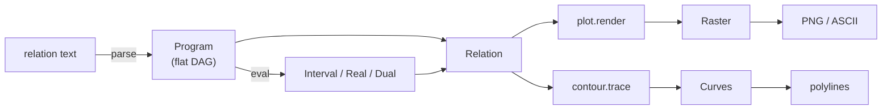

# Implicplot

Draw any implicit relation `f(x, y) op g(x, y)` using interval arithmetic.


The cover is `floor(15/(2pi) ln r) = floor(15/(2pi) theta) + k (mod 15)` for
five residues `k`, drawn by this plotter (`typst/make-thumbnail.sh`) - a step
relation whose solution set has area and no continuity, decided exactly by
the corner-sampling proof rather than any sign-change argument.

```console
$ zig build -Doptimize=ReleaseFast
$ ./zig-out/bin/implicit-plot "sin(x^2 + y^2) = cos(x*y)"
sin(x^2 + y^2) = cos(x*y)
  1024 x 1024 px over x in [-10, 10], y in [-10, 10]
  wrote plot.png
  137336 of 1048576 pixels lit in 37.8ms
```

`zig build run -- --help` lists the options: image size, ranges, output path,
sub-pixel refinement depth, worker count, and ASCII output.

## How it works

A box of the plane is either entirely in the solution set, entirely out of it,
or undecided. Interval arithmetic answers that question soundly: evaluate the
relation with intervals instead of numbers and the result _encloses_ every value
`f` takes on the box. A quadtree subdivides the undecided boxes until they are
one pixel, then a little further.



| file           | what it holds                                                             |
| -------------- | ------------------------------------------------------------------------- |
| `interval.zig` | interval arithmetic over `lanes` boxes at a time, plus three-valued logic |
| `real.zig`     | the same operations on plain floats, `lanes` points at a time             |
| `dual.zig`     | forward-mode differentiation, as a third arithmetic domain                |
| `expr.zig`     | the flat topologically-ordered node array, and the hash-consing builder   |
| `parse.zig`    | `"sin(x^2+y^2) = cos(x*y)"` to a `Relation`                               |
| `eval.zig`     | one evaluator, generic over the arithmetic domain                         |
| `relation.zig` | `f op 0`, and the two questions the plotter asks about a box              |
| `raster.zig`   | 1 bit per pixel, byte-aligned rows                                        |
| `png.zig`      | indexed 1-bit PNG encoder                                                 |
| `plot.zig`     | the quadtree, in pixel-index space, run in parallel                       |
| `contour.zig`  | the curve as polylines, by subdivision with a guaranteed topology         |

Three decisions carry most of the design:

**Every relation is `f(x, y) op 0`.** For an interval, `[a,b] - [c,d]` contains
zero exactly when `[a,b]` and `[c,d]` overlap, so the difference decides the
relation as precisely as comparing the sides - and the verdict, the definedness
test and the continuity test then all come out of a single evaluation. Writing
a relation against zero costs nothing: `Builder.sub` declines to subtract `+0`,
so `f > 1` and `f - 1 > 0` are one program rather than two equivalent ones, and
moving a term across the comparison cannot change the picture.

**The program is a DAG evaluated by one forward loop.** Operands precede their
parents, so `for (nodes) |n| values[i] = ...` computes each node exactly once and
shares repeated subexpressions for free.

**Boxes are integer pixel rectangles.** Splitting is integer arithmetic and
painting is an exact fill, so cells always line up with pixels regardless of the
image size.

Both the interval and the real domain are SIMD batches, so the plotter decides a
whole quadtree split, or all four corners of a box, in one vector pass. Below
`plot.render` nothing allocates: a plot's only heap traffic is the raster and one
scratch buffer per worker.

## As a Typst plugin

```sh
zig build wasm          # -> typst/implicit_plot.wasm
typst compile typst/manual.typ
```

```typst
#import "lib.typ" as ip
#let f = "sin(x^2 + y^2) = cos(x*y)"

#let pixels = ip.plot(f, size: (8, 8), x: (-1, 1), y: (-1, 1))
#let chains = ip.contour(f, n: 60, x: (-8, 8), y: (-8, 8))
```

`typst/` is also a complete Typst _package_: `typst.toml` names `lib.typ` as
the entrypoint, and `zig build wasm` puts the plugin next to it. Link that
directory into your Typst data directory as `local/implicplot/0.1.0` and it
imports as `@local/implicplot:0.1.0`; a Typst Universe submission is the same
directory minus the files `typst.toml` excludes (the manual and its assets).

The relation is one string with its comparison inside it, in the same language
the command line takes, and `plot` and `contour` accept the same one. `contour`
consults only the two sides, since tracing asks where they are equal: `"f <= 1"`
traces the boundary `"f = 1"`.

Two questions, two answers, and neither is an image:

- **`plot`** asks which pixels the curve may touch and returns **one byte per
  pixel**, row-major from the top - an 8 by 8 plot is a 64-byte array of 0 and
  1. It subdivides adaptively, it is rigorous, and it handles inequalities, so
     it resolves a curve finer than its own pixels and fills regions.
- **`contour`** asks where the curve is and returns **polylines**: arrays of
  `(x, y)`, closed curves repeating their first point, plus a count of cells
  whose topology is not guaranteed. Use it when you need a stroke.

`contour` is the algorithm of
[Plantinga & Vegter, _Isotopic Approximation of Implicit Curves and Surfaces_, SGP 2004](https://pure.rug.nl/ws/files/2952308/2004ProcGeomProcPlantinga.pdf)
with the stopping rule of
[Lin & Yap, _Adaptive Isotopic Approximation of Nonsingular Curves_, DCG 45, 2011](https://doi.org/10.1007/s00454-011-9345-9),
not marching squares on a grid. A grid has no way to know it is too coarse:
where the curve turns faster than the spacing it connects samples that are not
consecutive along the curve, and no post-processing detects it. The stopping
rule does know. A cell is finished when the interval enclosure of `F` over it
excludes zero, or when `0 not in Fx(C)` or `0 not in Fy(C)` - Lin & Yap's "Cxy" -
so `F` is strictly monotone in x or in y, so the curve is a single arc there
with no loop and no second branch. Under that condition the output is proved
_isotopic_ to the true curve. (Plantinga & Vegter's own clause,
`<grad F, grad F> > 0`, implies Cxy and so splits cells Cxy would have
accepted; measured here, the weaker rule is 1.67x faster for the same curve.)

Both clauses are things this project already had: interval arithmetic for the
first, and `dual.zig` - forward-mode differentiation as another arithmetic
domain, which `eval.Evaluator` runs without a line of change - for the second.

The tree is adaptive in the way that matters: `n` is how finely the curve is
resolved, not a grid walked everywhere. A circle in a large empty view costs one
evaluation per empty cell and comes back as 61 points; empty space is never
refined.

Where it stops short, it says so. `grad F` vanishes at a self-intersection, so
neither clause can ever hold there - the paper assumes zero is a regular value.
Those cells are counted in `uncertain` rather than passed off as correct.
Tracing a _raster_ instead would not help and is not a substitute: it follows
the outline of the band of lit pixels, which on a 60 by 60 circle is twelve
staircase fragments where tracing the field gives one loop.

### Wire format

The plugin speaks the
[wasm minimal protocol](https://github.com/typst-community/wasm-minimal-protocol).
Both exports take two arguments: the relation as UTF-8 source text, and 42
little-endian bytes of options - width and height as `u32`, the four range
bounds as `f64`, a depth byte (`plot`: sub-pixel refinement; `contour`: extra
refinement below the requested resolution, default 2), and one final byte only
`contour` reads: the uncertain-cell policy, 0 to keep arcs apart, 1 to contract
each uncertain cluster to a junction. The curve has values in those cells - they
sit on the curve - but the gradient vanishes there, so how the arcs connect is
not computable; the byte is the caller saying which reading their relation
warrants (a factorable relation genuinely crosses; a near miss does not).

The relation crosses as text because the parser is already there: `parse.zig`,
the one the command line uses. Nothing then identifies an operator by number -
`expr.Tag` and `interval.Op` have no numeric values, a function is spelled by
its own tag name and a comparison by `Op.symbol`, and the parser builds both its
tables and its error messages from those. So an operator is written down in
exactly one place, `lib.typ` has no table to keep in step with the Zig enums,
and adding one makes it writable in a document at once.

A relation that does not parse comes back as the protocol's failure message, as
does one over 64 KiB or nested past 256 levels - limits the parser has because
a document is untrusted input and freestanding wasm, with panics compiled out,
would otherwise trap without a word. The message is the caret report the command
line prints:

```text
error: plugin errored with: unknown name
  sin(x^2 + y^2) = cos(x*z)
                         ^
```
